 
 
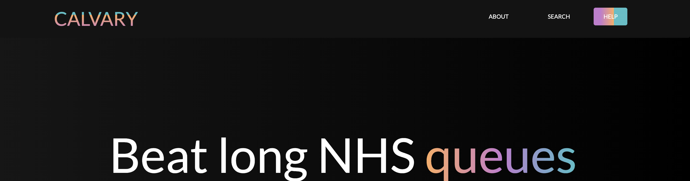

# Calvary Med

Due to the COVID virus, NHS waiting lists are twice as long even though there are not shortages of patients who need basic healthcare not related to covid.
Many UK residents are looking for quicker appointment times without having to spend a fortune on private healthcare.

Calvary Medical Services is an intermediary service that provides quicker GP appointments for people in the UK. Users can use a map to search for doctors in their preferred areas and then contact us with this information to get 24hour appointments instead of joining the general NHS line which is often long and may take many weeks to months. 
The map will show various doctors in the selected town and the user can pick ones closest to them or their preferred doctor.

### DEMO 
A  live demo version can be found HERE [https://bukiedow.github.io/CMED/.]


### UX
This site is intended for anyone who lives in the UK and wants faster doctors appointments but do not want to pay the cost of private health care.
The website consists of four (4) parts:
	
* Navigation bar-  This first line of eye contact has our name _CALVARY body on the left and three (3) links namely - About us (scrolls to about us page), search (scrolls to search page) and help button (scrolls to contact us page at the bottom). When minimised or viewed with mobile, it collapses into a menu with a hamburger button.
* The About us page - This is the first section that the user sees. It explains what the site is about and what service is being offered. On same section, there is a button called Doctor search that takes you to the next section of the page. 
* The Search page - This section houses the map search function. This is where users can input any town in the UK, search and find doctors in the UK. Different locations will appear on the map and be displayed as pins in the results box 
* The contact us page - After users have searched for doctors in their town, the pop up modal enables users send us a message with details about the service they want.
* Footer- This contains our properly linked social media accounts - Facebook, Twitter and instagram.

### USER STORIES
| S/NO               |  CRIB                               | PRIORITY (MOSCOW)        | USER STORY                                                                                                                                                                                                                            | ACCEPTANCE CRITERIA                                                                                                                                                                                                                                                                                                                                                                                                                                                                                                                                                                                                                            | SCREENSHOT                                                                       |
|--------------------|-------------------------------------|--------------------------|---------------------------------------------------------------------------------------------------------------------------------------------------------------------------------------------------------------------------------------|------------------------------------------------------------------------------------------------------------------------------------------------------------------------------------------------------------------------------------------------------------------------------------------------------------------------------------------------------------------------------------------------------------------------------------------------------------------------------------------------------------------------------------------------------------------------------------------------------------------------------------------------|----------------------------------------------------------------------------------|
| 1                  | Homepage (means entire website      | Must                     | As a user I need to see the elements and text as shown in the wireframe                                                                                                                                                               | * User should see all text and elements as shown in the wireframe Elements which include: Website name, About, Search, Help, Map, Contact form, Link to social media. User should be able to select all elements                                                                                                                                                                                                                                                                                                                                                                                                                               | 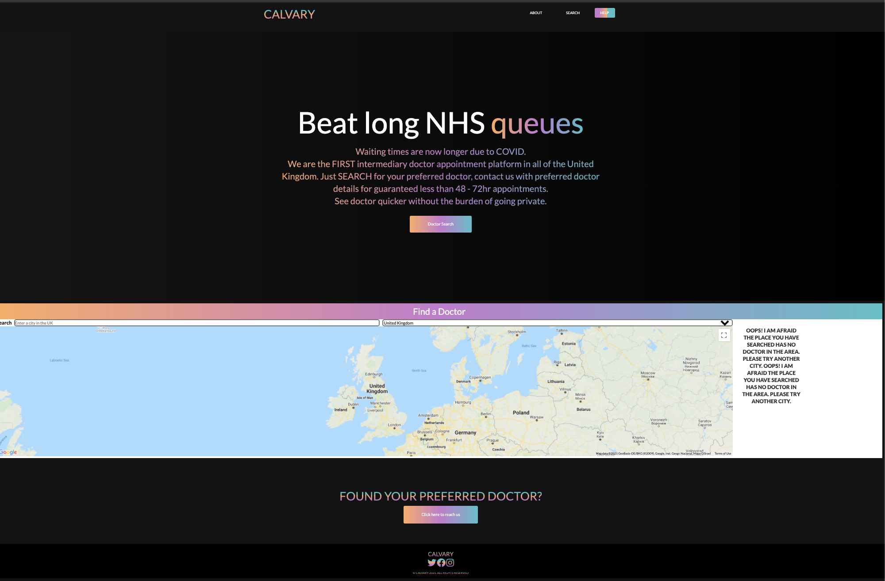                                           |
| 2                  | Website name/Logo                   | Must                     | As a user I need to see the name and logo of the website so that I am sure i am in the right place                                                                                                                                    | * Website name and logo is: "Calvary". * User can see the name of the website on the homepage.* Website name is clear. * Website name should be in the same colour and font of the other text (see wireframe)                                                                                                                                                                                                                                                                                                                                                                                                                                  |                                            |
| 3                  | Website Navigation                  | Must                     | * As a user I need to be able to see all links leading me throughout the website so that I know where to find information when i need i* As a user, the website should show me a dropdown menu when I am using a smaller screen size. | dropdown menu working when clicked on with smaller screen                                                                                                                                                                                                                                                                                                                                                                                                                                                                                                                                                                                      | 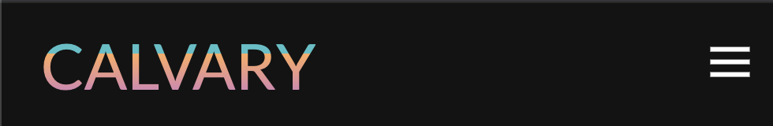 , 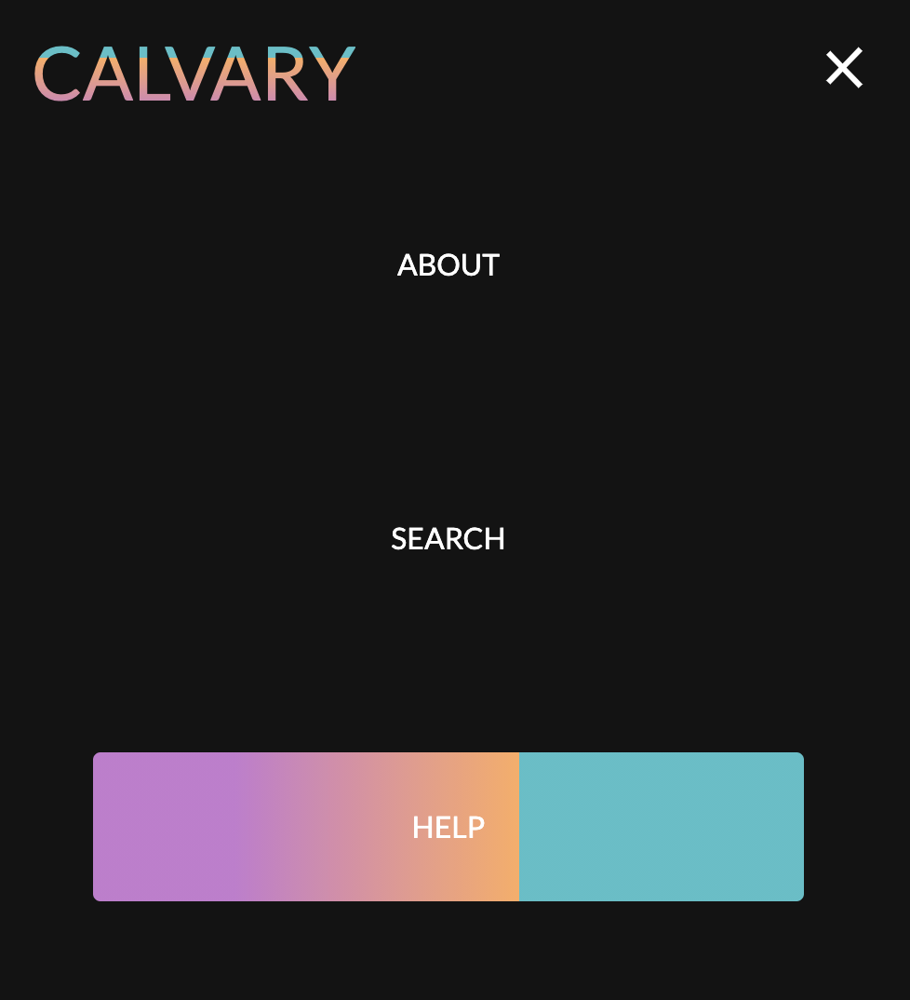  |
| 4                  | About section                       | Must                     | As a user I need to be informed of the offerings on the website so that I am well informed of the benefits.                                                                                                                           |   * The user should be able to access the "About" .  * The "About" message should be brief and clear. * "About" message should read: "Beat long NHS queues. Waiting times are now longer due to COVID.We are the FIRST intermediary doctor appointment platform in all of the United Kingdom". Just SEARCH for your preferred doctor, contact us with preferred doctor details for guaranteed less than 48 - 72hr appointments. See doctor quicker without the burden of going private." * "About" should contain a button called "Doctor Search" that leads the user to the search section of the website where they can search for doctors.  | 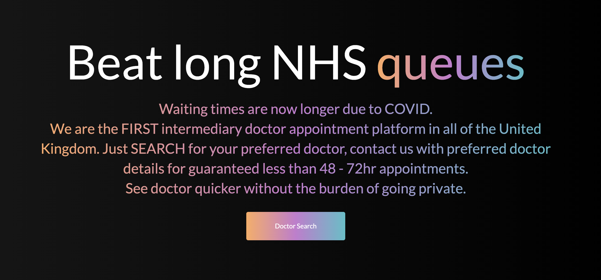                                                |
| 5                  | Map                                 | Must                     |  As a user I need to be able to see a map showing the United Kingdom so that I can confirm I am looking in my preferred area                                                                                                          | * The user should see a map of the United Kingdom. *User should be able to zoom in & out of the map. * The map should function just as google map.* User must see the heading of the page indicating they are entering the search area                                                                                                                                                                                                                                                                                                                                                                                                         | 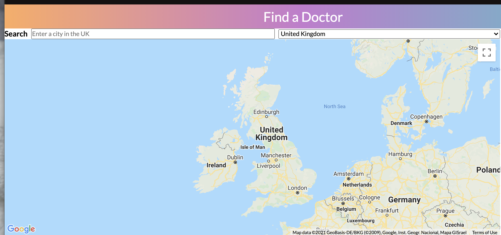                                                |
| 6                  | Map - Search                        | Must                     | As a user I need to search for doctors within my preferred city so that I can see the doctors close to me                                                                                                                             | * The user should be able to search the map for specific cities in the UK. * "Doctor search" takes the user to the map. *Only cities within the United Kingdom should be available. * Upon selecting a city, the user should see a list of doctors in the city.                                                                                                                                                                                                                                                                                                                                                                                | 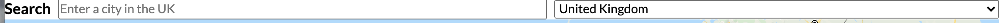                                            |
| 7                  |  Map - Search - Auto populate City  | Should                   | As a user I need to see a suggestion of related cities so that I can select my preferred city                                                                                                                                         | Upon typing the name of a city, the user should see a list of related cities. * The user cannot select more than one city at the same time. * The user should be able to select a city from the list displayed. * Upon selecting a city, the user should see a list of doctors within the city                                                                                                                                                                                                                                                                                                                                                 | 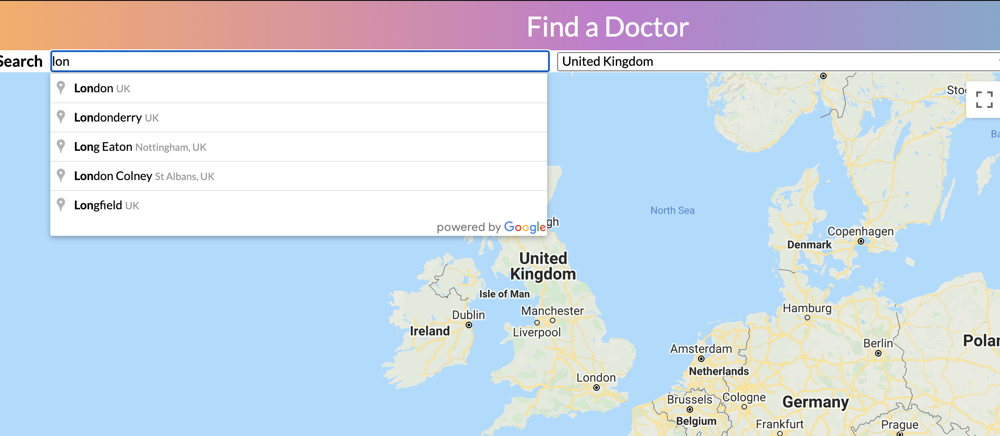                                     |
| 8                  | Map - Search - Doctor's List        |  Must                    | As a user, I need to see a list of doctors within my city so that I can access their contact information                                                                                                                              | * The list of doctors should display the names of the doctors. * User should be able to browse through the list. * The user should be able to select a doctor from the list displayed. * Upon selecting a doctor, the user should see the contact information of selected doctor* The Doctor's contact information should inlcude: Address, Telephone, Rating (If available),  Website (If available).                                                                                                                                                                                                                                         | 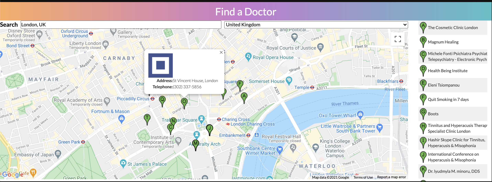                                |
| 9                  | Map - Search - No Doctors           | Must                     | As a user I need to be informed that there are no doctors within my selected city so that I can search in nearby cities                                                                                                               | * User should see a message if there are not doctors within their selected city.* Message should read: "OOPS! I AM AFRAID THE PLACE YOU HAVE SEARCHED HAS NO DOCTOR IN THE AREA. PLEASE TRY ANOTHER CITY. OOPS! I AM AFRAID THE PLACE YOU HAVE SEARCHED HAS NO DOCTOR IN THE AREA. PLEASE TRY ANOTHER CITY."                                                                                                                                                                                                                                                                                                                                   | 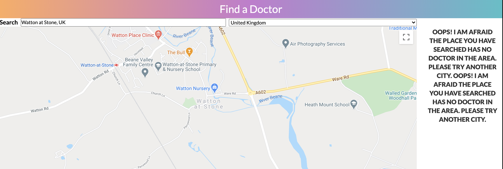                                           |
| 10                 | Contact us                          | Must                     | As a user I need to see clear direction on how to reach the service provider so that I can request a doctor.                                                                                                                          | * Verify the user see clear instruction on contacting the service provider. * Instruction should read: “FOUND YOUR PREFERRED DOCTOR? Click here to reach us”. * “Click here to reach us” takes user to “your details”.                                                                                                                                                                                                                                                                                                                                                                                                                         | 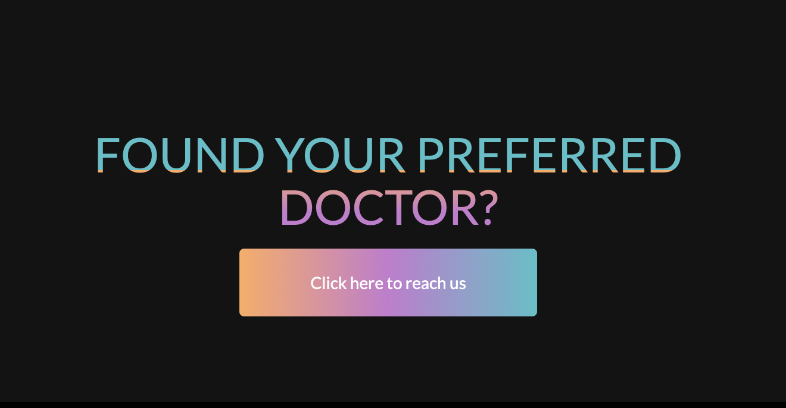                                           |
| 11                 | Your Details                        | Must                     | As a user I need to provide my contact details so that I can be contacted by my preferred doctor                                                                                                                                      | Your details” screen should be as indicated in the wireframe*	The user should be able to provide their contact details. Contact details includes:* Your Name * Your email * Subject* Are you or anyone close to you experiencing any COVID symptoms? * Message  All fields are required. * Upon completing the form and send, the user see a notification informing them that the form was sent successfully * Notification message should read: "Message sent"                                                                                                                                                                              | 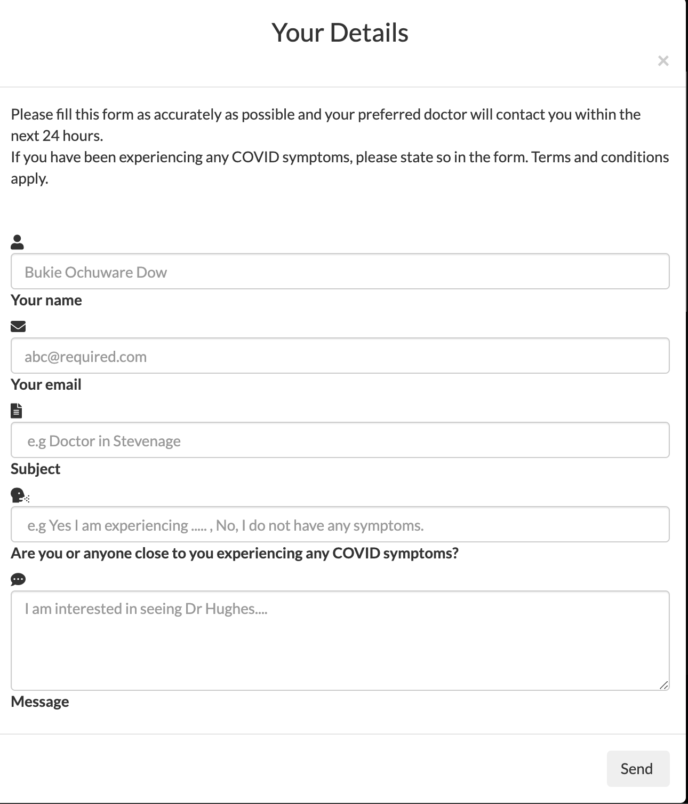 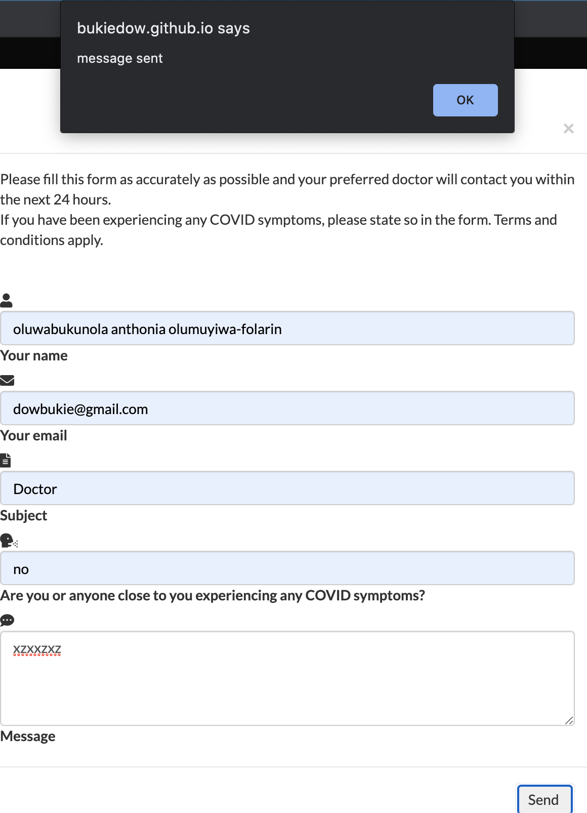  |
| 12                 | Your Details – Instructions         | Must                     | As a user I need to see clear guidance on the contact form so that I know what to do                                                                                                                                                  | * Verify the user see clear instructions on how to fill the form.* Instruction should read: "Please fill this form as accurately as possible and your preferred doctor will contact you within the next 24 hours. If you have been experiencing any COVID symptoms, please state so in the form. Terms and conditions apply."                                                                                                                                                                                                                                                                                                                  |                                         |
| 13                 | Your Details - Placeholder text     | Should                   | As a user I need to see sample texts explaining the required information per field so that I know what to do                                                                                                                          | The user should see sample texts explaining the information required in each field Sample text should read as follows: Fields	Sample text Your name	Bukie Dow Your email	abc@required.com Subject	e.g Doctor in Stevenage Are you or anyone close to you experiencing any COVID symptoms	e.g Yes I am experiencing… , No, I do not have any symptoms. Message	I am interested in seeing Dr Hughes…                                                                                                                                                                                                                               |                                         |
| 14                 | Social Media Link                   | Must                     | As a user I need to easily navigate to the social media profiles of the service provider so that I can connect with them better.                                                                                                      | The user should see the social media platforms where the service provider is available.* The available social media platforms should be represented by their logos.* Logos takes the user to the respective platform showing the service provider’s profile. * Verify the user can be navigated to the social media profiles of the service provider.* Social media platform available includes: Twitter, Facebook, Instagram                                                                                                                                                                                                                  |                                                |

### STRATEGY
The goal of the design was to make an eye-catching, seamless and fit for purpose website that can be used always.

### SCOPE
To provide visitors with another option for quicker GP appointments apart from private healthcare.

### STRUCTURE
The structure of this website promotes ease of navigation and beauty. 
 The navigation bar is always available for easy manoeuvre across pages. 
The page is structured to spark the users interest enough to contact us due to the vast choice of doctors in every area.

### SKELETON
Balsamiq was used for wireframes. [VIEW](https://github.com/bukiedow/CMED/blob/11f5b2ad222a526880fd4dac0a93df4ecf251864/assets/wireframe/CMED%20Wireframes.pdf)

Easy fonts - Lato and Roboto were chosen for uniformity and less complication due to the simple nature of the website.
Colours chosen is a mix of yellow, purple and torquoise known as Atlas because of its subtle yet bold nature which os perfect for a website with a short strong message such as this.

### TECHNOLOGIES
* HTML - To create the structure of the webpage- “as seen in the overall website structure”.
* CSS - To add styles to the webpage - “as seen in the design, font size and overall appearance of the website”.
* BOOTSTRAP - To improve responsiveness of the webpage - “ as seen in modal”.
* JAVASCRIPT - To enable interactive webpages - “ as seen in maps and modal”
* JQUERY - To enable interactive webpages - “as seen in maps and modal”
* BALSAMIQ - To create wireframes - “ as seen in mockups”
* FONT-AWESOME - Used for social media links -“as seen in website’s footer”
* GIT : To commit and push to Github - “as seen on Calvary’s repository available on …..”
* GITHUB - Ueed to house code after being pushed from git
* Google Fonts- To import the Lato and Roboto font - “ As seen in entire website”
* GoogleMaps API- To enable a responsive map -“ as seen in search section of the website”
* Google places AP - To enable country restrictions , pull up search results, enable keywords and general search - “As seen in Calvary’s website which is limited to the UK and results showing  available doctors in said location”
* MarkerClusterer CDN: To show pinpoint searched for areas and clusters on the map  - “as seen in search results and listings”

### FEATURES

#### Existing Features include:
* Feature 1 : Navigation including Interactive Navigation Links and menu - Allows the user to navigate between the pages of the website.  The pages of the website are: About us, search and help. The navigation menu also includes the name logo of the website informing users of the name.
* Feature 2 :About us page - Brief introduction of what the website is about as well as the services offered.
* Feature 3: Doctor search button - This takes the user to the search page.
* Feature 4 : Search - Allows the user to search for different locations to be displayed on the map.
* Feature 5: Maps - Allows the user to interact with the map and look for different locations.
* Feature 6: Contact us - this consists of of a contact us button which encloses a modal where users can fill in their information to contact calvary.
* Feature 7: footer 0 This contains our properly linked social media accounts - Facebook, Twitter and instagram and allows the user to be redirected to the NHS social media platforms.

#### FEATURES LEFT TO IMPLEMENT
* Assistive technology for blind, deaf and visually impaired people.
* Confirmation email to users when they send a doctor request.
* More countries to be included in next edition.

### TESTING
All links have been manually tested and function properly.

#### NAVBAR
* The logo is clickable text and directs the user back to the home page.
* The links are accurately spread out and legible. When clicked, they direct the user to the desired page. The help button is legible, bold and directs the user to the required page.
* The Navbar is sticky and scrolls along with the page as the user moves without blocking access.
* When minimised or used on smaller screens, the links collapse into a hamburger button and this button is clickable. When clicked, it drops down with the pages in its contents. These pages are still clickable and still direct the user to desired page.
* The navigation bar is visible and travels from the top pf the screen as the user scrolls down the webpage.

#### ABOUT PAGE
* Font is legible, bold and eye-catching.
* Message is positioned the centre of the page making it the first thing user sees and catches attention. 
* Messages short, concise and fit for purpose.
* Message and font and Is legible on various screen sizes. It remains legible when minimised too.
* The doctor search button is position properly on the page, just below the message and catchy. The hover button doesn’t cover the text on the button rather highlights it. The button is clickable and drops down to the search page it is linked to.

#### SEARCH PAGE
* The search page is clearly differentiated with the heading boldly written.
* The direction on how to use this section though not formally defined, contains instructions on how to use the page.
* The instruction to search is legible and bold, the browser bar includes a placeholder to further direct the user and finally the right hand side contains the country where the user is searching.
* The map is legible and spans most of the section. 
* The map is centred with the United Kingdom at the centre.
* When a city is entered in the browser bar, results are populated on the map in form of pointers and additionally as a list beside the map. 
* The results show an error message of “OOPS! I AM AFRAID THE PLACE YOU HAVE SEARCHED HAS NO DOCTOR IN THE AREA. PLEASE TRY ANOTHER CITY. OOPS! I AM AFRAID THE PLACE YOU HAVE SEARCHED HAS NO DOCTOR IN THE AREA. PLEASE TRY ANOTHER CITY.” when there is no doctor available in users chosen area.
* When the user starts typing in a city, suggestions of similar city show in form of a list.
* When the user inputs a city that is not in the UK, the maps does nothing.
* When the map is minimised, the error msg stays under the map.

#### HELP
* The message in this section is clear, short and straightforward to the point.
* This section contains useful information that is fit for purpose regarding the aim of the website.
* This section contains direction for use of objects in the section.
* The button in this section is bold, text is clear about directions for use and the hover works correctly.
* When clicked on, a modal pops up on the screen for user to enter informnation.
* The modal is responsive and  takes the height and width of the page when used on various screen sizes.
* Information on how to use the modal is included.
* Placeholders are visible on every input field and required.
* When a user puts in the wrong email address format, the user is prompted to please use the correct format with an “@“.
* If the user decides to stop using the modal at any point, there is a close button at the top right corner which closes the modal.
* When user sends a successful enquiry, the user gets a message sent alert.
* There is an Ok button available for user to click and close the modal.
* If user tries to resend another message, the form is clear and good to re-use devoid of previous information.

#### FOOTER
* The footer is legible and bold enough to be seen.
* When the link at the footer is clicked on, it takes you to the top of the page.
* Social media lcons are correctly linked and links to the NHS England twitter, Facebook and instagram account.

#### ENTIRE BODY
* The entire body of the website is consistent in design, the background is fluid, smooth scroll is evident and there are no elements lapping or outside the website’s borders.

Overall, this site was tested thus;
* HTML code is run and tested at   W3CHTMLVALIDATOR [https://validator.w3.org/] with minimal warnings.
* CSS code is run and tested at W3CJIGSAWCSSVALIDATOR [https://jigsaw.w3.org/css-validator/] with no errors but warnings about using other vendors such as webkit.
* Javascript is run and tested at JSHint [https://jshint.com/] with minimal warnings about editions.
* Family members and friends viewed the site and provided feedback on bugs and any issues.
* The Website was tested on Google Chrome, Firefox, Microsoft Edge and Safari browsers.
* The website was tested on a variety of devices such as Desktop, Laptop, iPad mini, iPhone 7, iPhone 8, iPhoneX and Nokia E30.

### KNOWN BUGS
* Sometimes there is an overflow of the maps results on some screen sizes. The text spills into the map container and looks transparent.

### DEPLOYMENT
The project was deployed to GitHub Pages using the following steps...
1. Log in to GitHub and locate the GitHub Repository
2. At the top of the Repository (not top of page), locate the "Settings" Button on the menu.
3. Scroll down the Settings page until you locate the "GitHub Pages" Section.
4. Under "Source", click the dropdown called "None" and select "Master Branch".
5. The page will automatically refresh.
6. Scroll back down through the page to locate the now published site link in the "GitHub Pages" section.

#### Forking the GitHub Repository
By forking the GitHub Repository we make a copy of the original repository on our GitHub account to view and/or make changes without affecting the original repository by using the following steps...
1. Log in to GitHub and locate the GitHub Repository
2. At the top of the Repository (not top of page) just above the "Settings" Button on the menu, locate the "Fork" Button.
3. You should now have a copy of the original repository in your GitHub account.

#### Making a Local Clone
1. Log in to GitHub and locate the GitHub Repository
2. Under the repository name, click "Clone or download".
3. To clone the repository using HTTPS, under "Clone with HTTPS", copy the link.
4. Open Git Bash
5. Change the current working directory to the location where you want the cloned directory to be made.
6. Type git clone, and then paste the URL you copied in Step 3.
$ git clone https://github.com/YOUR-USERNAME/YOUR-REPOSITORY
7. Press Enter. Your local clone will be created.
$ git clone https://github.com/YOUR-USERNAME/YOUR-REPOSITORY
> Cloning into `CI-Clone`...
> remote: Counting objects: 10, done.
> remote: Compressing objects: 100% (8/8), done.
> remove: Total 10 (delta 1), reused 10 (delta 1)
> Unpacking objects: 100% (10/10), done.
Click Here to retrieve pictures for some of the buttons and more detailed explanations of the above process.

### CREDITS
#### Content
* Most part of the code was written by me and crosschecked with bootstrap and w3schools.com
* for the maps, google api and typescript was used.

#### Acknowledgements
I received inspiration for this project from being tired of the endless NHS wait times. I also received inspiration from Brian Washby- a friend -from whom I first saw and loved mixed colour schemes for websites.

